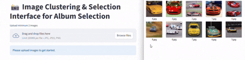
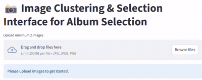
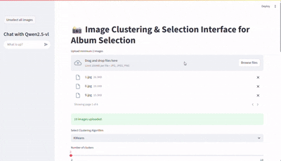

# Album Photo Selector
An assitant to **Album Photo Selecting** powered by AI

All the process implemented - from upload or remove photos, to splitting to groups by semantic similarity, and to assistance with a chat-bot for better filtering!


## Quick-Start
### Hardware Requirements
#### Minimum
- 8G RAM with GPU or 32G RAM without GPU
- GPU - minimum 8G VRAM
#### Recommended
- Intel i7 or Amd Ryzen 7 processors and above
- 16G RAM or more
- Nvidia GeForce RTX 4060 8G-VRAM and above
### Install/Run
#### Using docker:

cd into project directory:
```cd /project/folder```

**Build** the project:
```docker build -t image_selector .```

**Run** with supported gpu:
```docker run -d --gpus all -e USE_GPU=True -e BATCH_SIZE=8 -p 8501:8501 image_selector```

**Run** without supported gpu:
```docker run -d -p 8501:8501 image_selector```

### Start Guide
In browser, open ```localhost:8501```.

Upload photos using **Drag&Drop**,



or **Upload** Button.



Wait for processing all of the photos.

The photos will show in Gallery Format divided into clusters, you can delete every photo that you want to fileter in your album,
above the gallery you can control the clustering, by select between **KMeans** **DBSCAN** algorithms, and contorl the properties by the Slider.



In the Left Side-Bar you can see the Chat-Bot, it is configured to be Personal Album Assistat, you can select multiple photos by the Check-Box and ask the chat about them, you can ask questions like *'Which photo is better?'* *'Is this photo suitable to children album?'* and more.


In up of the Left Side-Bar you can find the button to deselecting all the photos that selected by Check-Box to using in the chat-bot.

## About the Implemetation
### UI
The Ui implemented by using [Streamlit.io](https://streamlit.io/) framework, this framework desined to Data-Science Visualization projects and it's good for controling in the components.
### Embedding Model
We chose to using **Jina-CLIP V2**, that described on this paper - https://arxiv.org/abs/2412.08802.

The benefits of this model is that it trained on pairs of textual description and images that makes it good for retrieval letants with a Semantic attention.

### Clustering Algorithms
#### K-Means
You can read here: https://en.wikipedia.org/wiki/K-means_clustering about the algorithm.

We chose to mesure the distance between the vectors by [Cosine Similarity](https://en.wikipedia.org/wiki/Cosine_similarity).
#### DBSCAN
You can read here: https://en.wikipedia.org/wiki/DBSCAN about the algorithm.

In this implementation, clusters smaller than a configurable threshold are not removed, unlike the original DBSCAN algorithm.

We chose to mesure the distance between the vectors by [Cosine Similarity](https://en.wikipedia.org/wiki/Cosine_similarity).

### Chat-Bot Model
We chose to using **QWEN 2.5 VL**, that described on this paper - https://arxiv.org/abs/2502.13923.

The benefits of this model is that it very good to aware small details in pictures - even text understanding as describe in the paper (it's happen by using almost all the letents that's coming from the vision embedder), and it much smaller to running locally,
in this project for security it implemented to running locally so it is big advantage.

## Source Files Tree

- [**streamlit_app.py**](./streamlit_app.py) - Streamlit UI code
- [**Dockerfile**](./Dockerfile) - Main Docker File
- [**requirements.txt**](./requirements.txt) - Python dependencies
- [**src**](./src)
    - [**chat_impl**](./src/chat_impl) - Chat implementation
    - [**image_clusterer**](./src/image_clusterer) - Clustering algorithms implementation
        - [**distance.py**](./src/image_clusterer/distance.py) - DBSCAN implementation
        - [**k_means.py**](./src/image_clusterer/k_means.py) - K-Means implementation
    - [**image_embedder**](./src/image_embedder) - Embedding image to latent model implementation
- [**test.ipynb**](./test.ipynb) - Jupyter notebook to test clustering algorithms
